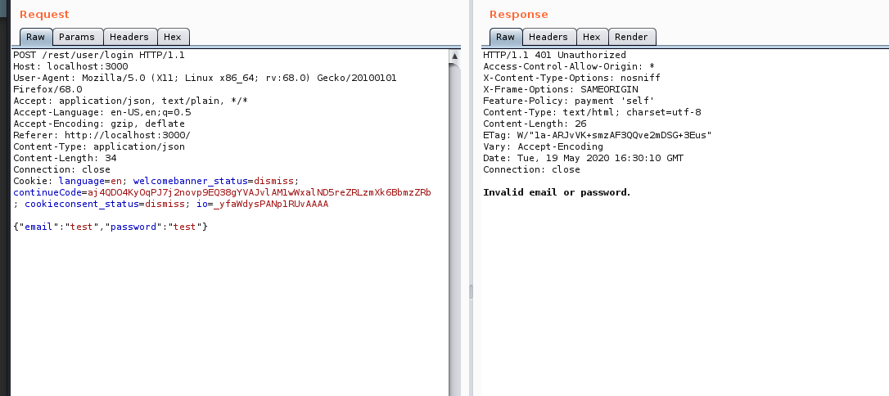
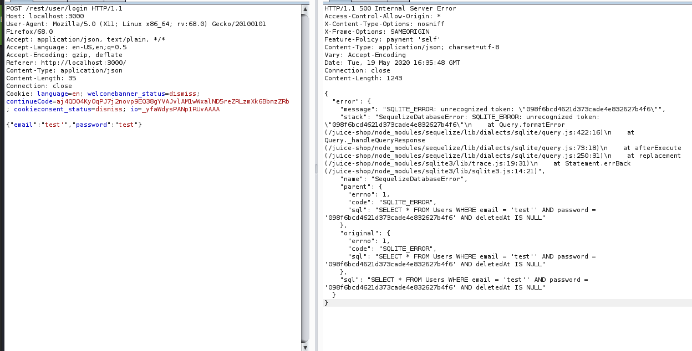

---
author: Nickapic
title: "SQL Injections Level-1"
date: 2021-04-24
description: This is a article to teach people on a very basic level about how to do SQLi, basic SQL syntax, common attack vectors and also how to fix these common attacks and make your apps more secure.
series: ["SQL Injection"]
tags: ["SQLi","Web",Hacking", "Web Security"]
categories: ["Offensive Hacking", "Begginers"]
ShowBreadCrumbs: true
--- 

### What it is ?

Sql injection is an attack in which  malicious SQL Statements are injected into a SQL database to gain stuff like sensitive information,modify databases,and potentially even get a shell.They are very easy to avoid though but stilll happpen a lot.

### Common Syntax and Verbs→

SELECT → Retrivies data from a table for us

INSERT → Adds data to a table

DELETE → Removes data from a data table

UPDATE → Modifies data in a table

DROP → Delete a whole table

UNION → Combines data from multiple queries 

WHERE → Filters records based on spefic conditions

AND/OR/NOT → Filter records based on multiple conditions

ORDER BY → Sorts records in ascending /descending order.

Example Statements →

SELECT * FROM Users; #Selects everything from a user table for us basically.

SELECT UserID UserName From Users;  # Selects every Userid ,username from the table.

SELECT * FROM Users WHERE Country='RU'; # Selects everyone whose country is RU in the Table 

SELECT * FROM Users WHERE Country="US"AND UserName='Frank'; #Selects a user whose name is Frank and is from the US.

Special Characters →

' and " are string delimiters .

 - -, /* and # are comment delimiters 

*and% are wildcards (Will select everything)

; - Ends a SQL Statement

Plus a bunch of these other ones that follow the programmatic logic =,+,>,<,(), etc.

### Attacks →

So lets turn on our Burp Suite first and Intercept and when we first intercept the request we see the format it sent in and now we can send it in Repeater and see how thats working and how it responds to our request .

And Now lets try to see whats going on 

So if its not secure what should be happening is something like 

Input : test

SQL : SELECT * Users WHERE email ="test";

If we do SQL Injection what we can do instead is send somehting like 

Input = test'

SQL = SELECT * FROM Users WHERE email='test' ';

Now this will throw a error for us but in somecases it can also do Injection for us and give us what we want so lets try it in Repeater . 

This now gives us great information  and if we see an error like this it proves that we have some kind of injection that we can do like a huge sign and this case it also shows us the SQL statement which is very bad btw.

Now lets try something even more MALICIOUS like change our input to this →

Input = test' OR 1=1;  - -

SQL: SELECT  * FROM Users WHERE email="test" OR 1=1; - - Comment out every other conditon So because we add 1=1 this is always gonna be true and we will comment out the rest of the SQL Condition and we end the statement afte 1=1 by ;

And what happens here is it will let us login with this statement and its mostly gonna be the admin because most of the times the first account is from the admin in the table ( Typically Ofcourse ).

And now lets try it in the login section after we turn our proxy and boom we are in . Where you can see the errors and stuff its called Classic SQL Injection but where you cannot see these its called Blind SQL Injection and they are a bit more complex to do .

So to check the other way if we have SQL injection we can use (sleep 5) sleep terms these are written diffrently in diffrent Languages but yeaah what this will do is make the server not respond to your request for the time defined in the Sleep parameter and then you can do SQL Injection.Burp Active Scanner does this for us btw.

### Defences →

The two big ones are Parameterized Statements so this means we have to Ensure inputs (parameters) are used safely in SQL statements.

Example: "SELECT * FROM users WHERE email=?";  (Good Example)

Example: "SELECT * FROM users WHERE email="'+email+""; (Bad Example )

Sanitizing Input - So just prevent the input that is provided is santized and we remove the weird symbols and dont let people have the possibilty to do stuff like 1=1  - - kinda thing.

### Resources :

Here are some great resources you can learn more about these :
1. Tryhackme : https://tryhackme.com/room/sqlilab
2. ComputerPhile : https://www.youtube.com/watch?v=ciNHn38EyRc
3. PortSwigger : https://portswigger.net/web-security/sql-injection
4. INE : https://my.ine.com/CyberSecurity/learning-paths/a223968e-3a74-45ed-884d-2d16760b8bbd/penetration-testing-student